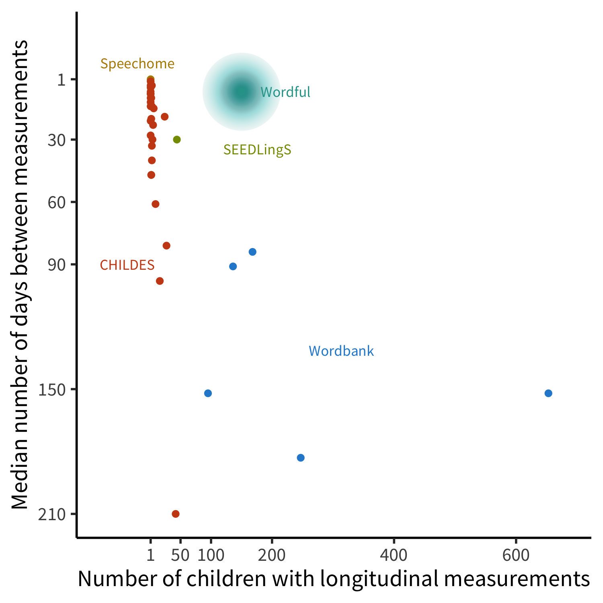
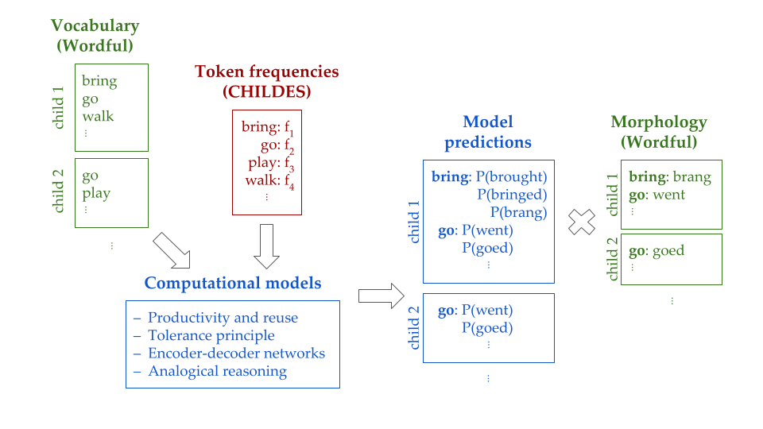

# Conclusion {#conclusion}

## Summary

The studies in this thesis examined children's lexical and morphological development, while aiming to facilitate generalization across children, over development, and among languages.

First, Chapter \@ref(aoa-pred) consisted of a study on which properties of words make them easier or harder for children to learn. We found more consistency across languages in these properties than would be expected by chance, reflecting a broad similarity of word learning processes at play cross-linguistically. We also found substantial differences among lexical categories, suggesting different learning routes for content and function words.

Next, Chapter \@ref(cdi-overreg) applied similar methodology to investigate patterns in morphological development. Aggregated across children, we found a strong relationship between vocabulary growth and the degree of both correct irregular inflection and overregularization, indicating that lexical and morphological development are tightly coupled. We also saw an effect of age over and above vocabulary, implying that there are age-related processes affecting morphological development that are not captured by vocabulary. For individual children, morphological development patterned in diverse ways but tended to hang together between nouns and verbs.

Finally, Chapter \@ref(prod-comp) investigated morphology learning in a language-agnostic way by comparing the predictions of a variety of models of morphological productivity on parametrically-variable corpora. These analyses revealed the different ways in which specific distributional features of the linguistic input -- the type and token counts of regular and irregular forms -- affect the behavior of these models. Understanding these differences is crucial to finding empirical cases that distinguish among theories.

While these studies have led to insights into the processes of language learning, they have not yet involved combining sufficiently rich data with sufficiently well-instantiated models to gain theoretical traction on the nature of morphology learning. As such, I end by laying out a plan for a series of studies that build on work in this thesis by using dense data to evaluate theories of morphology.

## Evaluating theories of morphological development using dense data

Previous work has largely used two data sources on lexical and morphological development: parent-report checklists of children’s vocabularies, particularly the CDI [@fenson2007], and transcripts of recordings of children’s speech, e.g. corpora in CHILDES [@macwhinney2000]; Speechome [@roy2015]; and SEEDLingS [@bergelson2016]. While such recordings tend to be collected often per child, they suffer from small sample sizes in terms of the number of children (limited by high transcription cost). Conversely, the standardized and cheap nature of the CDI allows for large sample sizes, but because the CDI is only administered at most every few months, the temporal density of its longitudinal data is limited.

```{r wordful-motivation, fig.cap="Properties of longitudinal corpora of language development data (each point represents one corpus). Wordbank (CDI) data have large N but low temporal density. Naturalistic recordings (e.g., CHILDES, Speechome, SEEDLingS) tend to have high temporal density but low N. Wordful is a novel data collection method that achieves both a large N and high temporal density.", out.width="60%"}

```

To address the drawbacks of both CDI data and speech recording samples, we developed a novel data collection method, a smartphone app called Wordful [@meylan2019]. Wordful takes advantage of the prevalence of smartphones to collect parental report data scalably and flexibly through a mobile application that parents use to keep track of words in their children’s vocabulary as they are produced. This enables the creation of datasets that have both larger sample sizes as in the CDI and higher temporal density as in speech recordings (Figure\ \ref{fig:wordful-motivation}). Using Wordful, caregivers report on their child’s word production by being presented with cards showing a word and swiping left (no) or right (yes) to indicate whether they’ve heard their child say that word. Wordful also has a flexible system for sending parents custom questionnaires, such that studies can ask specific questions contingent on a child’s vocabulary, age, or other properties.

We plan to use Wordful to create a rich dataset on the morphological development of a large sample of children and use these data to quantitatively evaluate theories of morphology learning. In Study 1, we will conduct a cross-sectional study to assess which properties of words influence their propensity to be overregularized and irregularized. These data will allow us to examine the interplay between memorization and generalization in morphology learning. Then in Study 2, we will conduct a larger, longitudinal study allowing us to characterize the developmental trajectories of (over)generalization for individual children and words. These trajectories constrain the learning mechanisms that children use to make inferences. Finally, Study 3 involves instantiating theories of morphology into comparable computational models, allowing us to test each theory quantitatively on equal footing, and meaningfully compare between proposals using the data Study 2.

<!-- For both Study 1 and Study 2, we will use Wordful to conduct studies of English-speaking children’s morphological development using the case study of past tense verb inflection. For both studies, we will recruit parents to use Wordful and use its word swiping and word journal components for a weeks/months interval of time to collect data on which words their children say. At the same time, we will use Wordful’s custom questionnaire functionality to query parents for their child’s inflectional behavior for words the parent has already entered. These questions will ask about how, if at all, the child uses a given verb to talk about the past tense, including the whether they use the correct, overregularized, and/or irregularized forms as appropriate to the item. Study 1 (N=200) will be cross-sectional, meaning that parents will use Wordful for around a month and will only answer the inflection question for a given verb once; Study 2 (N=100) will be longitudinal, meaning that parents will use Wordful for around six months and inflection questions about a given verb will be re-presented to them after a delay. As such, Study 1 will allow us to collect data from enough children to investigate differences among individual words, while simultaneously serving as a pilot study to prepare for Study 2. We will then be able to create a large-scale longitudinal dataset in Study 2, which will in turn serve as evaluation data for modeling in Study 3. -->

### Study 1: Characterize generalization patterns by verb

__Motivation: Overregularization__. What does a child saying _goed_ or _eated_ tell us about what they know? They must have not yet memorized the corresponding correct form (_went_ or _ate_) and they must be using some process of generalization to add -_ed_ to _go_ or _eat_, because _goed_ and _ate_ are not in the input they have received from adults. So, if children are overall more likely to overregularize _go_ (by saying _goed_) than _eat_ (by saying _eated_), there must either be something about _went_ that makes it less likely to be memorized than _ate_, or something about _go_ that makes it more likely to have -_ed_ added to it than _eat._ What verb properties affect their propensity to be overregularized, and what do that tell us about these processes of memorization and generalization?

A number of corpus studies have found that less frequent irregulars are more likely to be overregularized [@maratsos2000; @marcus1992; @maslen2004]. Additionally, a corpus analysis of the same data found that irregulars for which the stem has a more dominant vowel than the past tense form are more likely to be overregularized [@stemberger1993]. Lastly, an elicited production study with older children found that irregulars that are more phonologically similar to regulars are more likely to be overregularized [@marchman1997productivity].

To the extent that variation in verbs’ susceptibility to overregularization can be explained by frequency, the memorization component would likely be responsible, as more frequent forms are more likely to be memorized. Conversely, to the extent that phonological properties of verbs affect their overregularization, generalization must be sensitive to them. So, we can characterize the interplay between memorization and generalization by quantifying the contribution of each of these item-level properties to robust estimates of overregularization rates.

In other words, we plan to rigorously test the previously-observed effect of frequency on overregularization and to extend the effect of phonological similarity from elicited production data to more naturalistic data. In addition, we go beyond previous work by obtaining more robust estimates of overregularization rates for more verbs and assessing the relative contributions of the various factors in a comparable way.

__Motivation: Irregularization__. What can we learn from a child saying _brang_ or _brung_ as the past tense of _bring_? Not only have they not memorized _brought_, but they are also extending the irregular patterns of _sing_-_sang_ or _cling_-_clung._ Existing corpus data is too sparse to reliably measure rates of irregularization, let alone the differences in these rates for different verbs. While there are not that many verbs that could potentially be irregularized (i.e., that meet the phonological conditions of an irregular pattern) and that young children might know, we can cover them more fully and thus attempt to test the parallel exploratory hypothesis that verbs are more likely to be irregularized if they are less frequent and more phonologically similar to irregulars.


<!-- Participants. We will recruit parents to use Wordful for approximately one month, targeting those with children that are around 24–36 months  (an age range during which children show a range of overregularization behaviors; see Frank et al., 2021). Parents will be recruited through Prolific, a panel survey vendor. We will initially recruit 300 parents, aiming for a sample size of around 200 accounting for attrition rates. We will use Prolific’s demographics-based sampling to recruit a diverse group of parents, aiming for a census-representative sample. Participants will receive \$5 via gift card if they engage with the app by answering a morphology questionnaire at least once in the month-long period, \$10 if they do so at least once per week, or \$15 if they do so at least twice per week, incentivizing them to engage with the app more often. Participants will also be asked to complete a demographic questionnaire with questions about the child (assigned sex at birth, ethnicity, birth order, language exposure, risk of language disorders) and the family (household income, caregiver education level, caregiver languages). -->

__Design__. We will recruit parents to use Wordful for approximately one month, targeting those with children that are around 24–36 months (an age range during which children show a range of overregularization behaviors, as observed in Chapter \ref{cdi-overreg}). Once a parent has indicated that their child says a given verb (e.g. _bring_), we will send them a custom questionnaire in the app, presenting them with a list of possible inflected form(s) of that verb (e.g. _bringed_, _brang_, _brought_, other, none) and asking them which of those forms their child uses.
<!-- These questions will be pushed out once per day in a batch to maximize responses from parents. Since parents will be repeatedly answering questions about their child’s usage of past tense forms, we expect them to quickly start attending to those forms specifically, even if they were not noticing them previously. -->

We will target these questions for a large set of verbs, both regular and irregular.
Specifically, the target verb list will be chosen to cover a broad range of frequencies and phonological properties, such that we have the power to assess the relative contribution of each factor.
In addition, we will include all verbs that can be irregularized (i.e. that match the phonological conditions of irregular patterns) and are likely to be known by at least some children in the study age range (as measured by them appearing in children’s speech in CHILDES corpora).
<!-- We will also ensure that all verbs that are in the morphology section of the CDI are included in this set for validation purposes. -->
For each irregular verb (e.g. _run_), the options presented in the question will consist of the unchanged stem (_run_), the correct past tense form (_ran_), the overregularization of the stem (_ranned_), the overregularization of the past tense form (_runned_).
In addition, if the verb matches the phonological conditions of an irregular pattern, the application of that pattern will also be included as an option (e.g. _stang_ for _sting_).
<!-- The parent will be able to select more than one option if they’ve heard their child use multiple different forms. -->
<!-- By default, the word swiping component of Wordful uses all the words on the CDI, so we will supplement it with all verbs that are items in our inflection questions. -->

__Analysis__. For each verb (e.g. _bring_), we will calculate its (1) overregularization rate: how many children over the course of the study were reported to say its overregularized form(s) (_bringed_, _branged_); (2) irregularization rate: how many children over the course of the study were reported to say its irregularized form (_brang_, _brung_).
<!-- The sets of verbs for which we calculate each of the two rates will be different, since only some verbs can be overregularized (only irregulars) and only some verbs can be irregularized (only ones that meet phonological conditions of irregular patterns). -->
For each verb, we will estimate its frequency and its phonological similarity to regulars and to irregulars (i.e. its phonological neighborhood density within each) from child-directed speech in CHILDES corpora.

<!-- Validation. From existing CDI data, we have obtained estimates of the overregularization rates of 21 English verbs (Braginsky et al., 2020). We will use these estimates to validate the rates measured through Wordful, similar to the vocabulary validation in the Wordful pilot study. We expect a high correlation between verbs’ overregularization rates as measured by the CDI and by Wordful. Assuming this is the case, we will be able to also use the rates for our additional words not on the CDI, and our irregularization rates (which are not measured on the CDI) for further analysis. -->

We will use generalized linear mixed effects models (as the data will have repeat measures of children and of items) to predict verbs’ overregularization and irregularization rates from their frequency and phonological similarity to regulars and to irregulars. We will assess the presence of each of these effects, their relative magnitudes, and whether they interact. We expect that both overregularization and irregularization rates will be substantially higher than previously reported, because our data overcome previous sparsity issues. Further, we expect that the relationship between each verb and the structure of the verb lexicon will influence over(ir)regularization rates, in that verbs that are less frequent and/or more phonologically similar to regulars will be overregularized more, and that verbs that are less frequent and/or more phonologically similar to irregulars will be irregularized less. Larger effects of frequency would implicate memorization mechanisms, while larger effects of phonological similarity would implicate generalization mechanisms.

### Study 2: Relate learning trajectories in morphology to language development

__Motivation__. What has changed about a child if they had been saying went, but now say goed? What about if they had been saying goed, but now say went? To the extent that these transitions are linked increases in the child’s vocabulary, it suggests that generalizations are formed on the basis of the lexicon; to the extent that the changes occur at a given age, it suggests that there is a separate developmental progression at play. In addition, children having periods of overregularizing many words concurrently would be indicative of the operation of a global rule; conversely, different words being overregularized at different times would be indicative of an item-by-item generalization process.

The data from Study 1 does not allow us to make these distinctions, as it is cross-sectional. Thus the goal of Study 2 is to conduct a longitudinal study to measure how each individual child’s inflection behavior changes over time and determine what drives these changes. Specifically, we hypothesize that children’s tendencies to generalize, overregularize, and irregularize are all more strongly related to their vocabulary size than to their age. While all theories would agree that vocabulary and age are both relevant at least to some extent, evaluating the relative strength of the two factors reveals the extent to which morphology learning is driven by lexical learning or by other developmental changes.

Further, we hypothesize that overregularization and irregularization trajectories vary for individual children and individual items, both in shape and timing, as suggested by previous work [@hoeffner1992; @plunkett1993]. That is, rather than there being a global period in which all children (or even one individual child) tends to overregularize all items, we predict that only some children and items exhibit U-shaped curves (i.e., first inflect correctly, then overregularize, then inflect correctly again); and that the inflection points for these curves occur at various points in development rather than at the same time. The analyses in this study will evaluate the extent to which trajectories overlap or diverge across children and across items, providing a degree of empirical precision that previous data could not achieve.

<!-- Participants. We will recruit parents to use Wordful for approximately six months, targeting children that are 24–30 months at start time (30–36 months at end time), in line with the age range in Study 1. Parents will again be recruited through Prolific, again recruiting a diverse and representative sample. Our initial recruitment target will be 300 parents, aiming for a sample size of 100 accounting for attrition rates over the course of the study. As in Study 1, participants will be compensated based on how often they engage with the app, receiving \$5 via gift card for any response, \$5 each month for at least four responses in the preceding 1 month period, or \$10 each month for at least eight responses. -->

__Design__.
We will recruit parents to use Wordful for approximately six months, targeting children that are 24–30 months at start time (30–36 months at end time), in line with the age range in Study 1.
We will use the same inflection questions as in Study 1, but once the parent has reported on forms of a verb that their child uses, we will ask that question again in two weeks.
We will also use the same items as in Study 1, possibly adjusted based on the results of that study. For example, items that are never (or extremely rarely) produced in the Study 1 data would be excluded from Study 2 to conserve on how much is asked of parents.

__Analysis__. For each child, we will have a continuous measurement of their age and a rolling estimate of their verb vocabulary size from the word swiping component. We will categorize their responses to inflection questions as indicating that they generalize, overregularize, and/or irregularize each verb, resulting in a rolling estimate of their rates of each behavior. Each child’s series of responses for each item will constitute a trajectory for that item.

In the first analysis, we will use generalized linear mixed effects models to predict the estimates of children’s rates of generalization, overregularization, and irregularization from their verb vocabulary size and age. In the second analysis, which we will use similar models to categorize each item’s trajectory as one of: increase (response(s) of correct form or none followed by response(s) of overregularization); decrease (overregularization, then correct form or none); recovery (correct form, then overregularization, then correct form); retreat (overregularization form, then correct, then overregularization form); or chaotic (no discernible pattern). For each child, we will measure the extent to which they tend to exhibit the same type of trajectories for all items or different types of trajectories for different items. For each child’s recovery trajectories, we will estimate the inflection point of the trajectory, indicating the age or vocabulary size at which the child’s treatment of the item changes.

For the first analysis, we expect that vocabulary size will be a stronger predictor than age of all inflection behaviors. For the second analysis, we expect that each child’s items will vary in the type of overregularization trajectory they display (some U-shaped, others not) and in the timing of the inflection points of those trajectories.

### Study 3: Using computational models to distinguish among theories of morphology

__Motivation__. The analyses from Studies 1 and 2 give broad signatures of the operation of the mechanisms of generalization and memorization by placing morphological development on a continuum between item-based and global inference. To understand these processes more deeply, here we use more detailed learning models to make fine-grained quantitative predictions, and use these to evaluate instantiations of different theories.

A persistent challenge in comparing theories of morphology learning is that models tend not to be tested with clearly differentiated predictions on data that is rich enough to distinguish between them. Because of the difficulty in bridging these gaps, there has been an impasse in argumentation about the predictions of competing theories. For example, dual-route proponents have claimed that connectionist models can only learn rules for which a majority of types are regular [e.g., @marcus1995jcl], but subsequently many connectionist models have been able to learn systems where even a relatively small proportion of types is regular [@hahn2000; @nakisa1996; @plunkett1997]. Conversely, connectionist modelers have claimed that a dual-route model must exhibit a sharp discontinuity in rate of overregularization [e.g. @hoeffner1996], but whether this is in fact the case is highly dependent on the (unspecified) rule-discovery mechanism of a dual-route account [@odonnell2015]. More generally, rigorous testing of different models’ predictions, rather than qualitative claims about their behavior, requires grounding them in larger and denser data [@meylan2017].

More recently, a new theory has been proposed for explaining inferences about morphological productivity, namely the tolerance principle [@yang2016]. According to this framework, across a wide range of phenomena, children determine whether to form a  general rule or store specific forms on the basis of comparison between the sequential search time of these two possible representations. The assumptions made by this model result is a simple heuristic that compares the number of forms that conform to the rule against the number of forms that do not. While this model is claimed to account for children’s morphological behavior in both corpus and experimental studies [@schuler2016; @yang2016], no study has compared the predictions of the tolerance principle with those of other models on equal footing.

__Models__. Our goal is to comprehensively evaluate theories of morphology learning. As such, we will include a broad range of the computational modeling frameworks that have been applied to the English past tense. The models we plan to include are the productivity and reuse trade-off [@odonnell2011; @odonnell2015; @odonnell2009; @odonnell2011], the tolerance principle [@yang2005; @yang2010; @yang2016; @yang2017]; modern encoder-decoder neural networks [@cotterell2016; @kirov2018]; and analogical reasoning [@daelemans2005; @skousen1989].

__Training__. The input data for the models will be derived from the Wordful vocabulary data collected in Study 2 (top left box in Figure \ref{fig:wordful-diagram}). For each child, this will consist of a series of timepoints of that child’s verb vocabulary, i.e. the set of verbs that the child has been reported to say. For each of these verbs, we will also obtain an estimate of its token frequency in child-directed speech from CHILDES corpora (a necessary simplification due to the prohibitive cost of measuring individual children’s input frequencies). Each model will be fit to each of these by-child timepoints and will then be used to generate predictions about that child’s inflections at that time, i.e. a probability distribution over possible inflected forms of each verb (center box in Figure \ref{fig:wordful-diagram}).

__Evaluation__. The evaluation data will be based on the inflection data collected in Study 2 (right box in Figure \ref{fig:wordful-diagram}). For each model, the probabilities of the inflected forms that each child was reported to produce at each timepoint will be combined into an overall likelihood of the observed data under that model. To prevent overfitting, regardless of models’ parameterization, we will perform cross-validation over verbs and children, training on a subset of the data and evaluating on the held out subset. We will then compare the models’ overall prediction error to evaluate which models perform best.

__Error analysis__. In addition to the overall evaluation, we also want to determine what specific inferential pathways are involved in the models’ successes and failures. To do this, we will perform a systematic evaluation of the errors that each model makes, e.g. whether the model tends to overregularize too much or not enough compared with children and what categories of verbs it tends to inflect differently than children.

```{r wordful-diagram, fig.cap="Diagram representing the structure of Study 3. Vocabulary data from Wordful and token frequency information from CHILDES serves as the input to models. The resulting predictions over possible past tense productions are then compared to morphology data from Wordful to evaluate these models."}

```

### Summary {#wordful-summary}

To learn the structure of words, children need to generalize beyond their input, while simultaneously memorizing exceptions to these generalizations. How do children learn to balance item-specific and global knowledge to generalize without overgeneralizing? We propose a series of studies that entail collecting large, dense data on children’s morphological development using a novel app-based data collection method and using these data to quantitatively evaluate theories of morphology learning. In Study 1, we conduct a cross-sectional study to assess which properties of words influence their propensity to be overregularized and irregularized. In Study 2, we conduct a larger, longitudinal study allowing us to characterize the developmental trajectories of (over)generalization for individual children and words. Finally, Study 3 involves instantiating theories of morphology into comparable computational models allowing us to use the data from Studies 1 and 2 to quantitatively test the predictions of theories on equal footing. The combination of dense data and modeling will allow us to advance the empirical and theoretical understanding of morphology learning and of the mechanisms underlying memorization and generalization.
